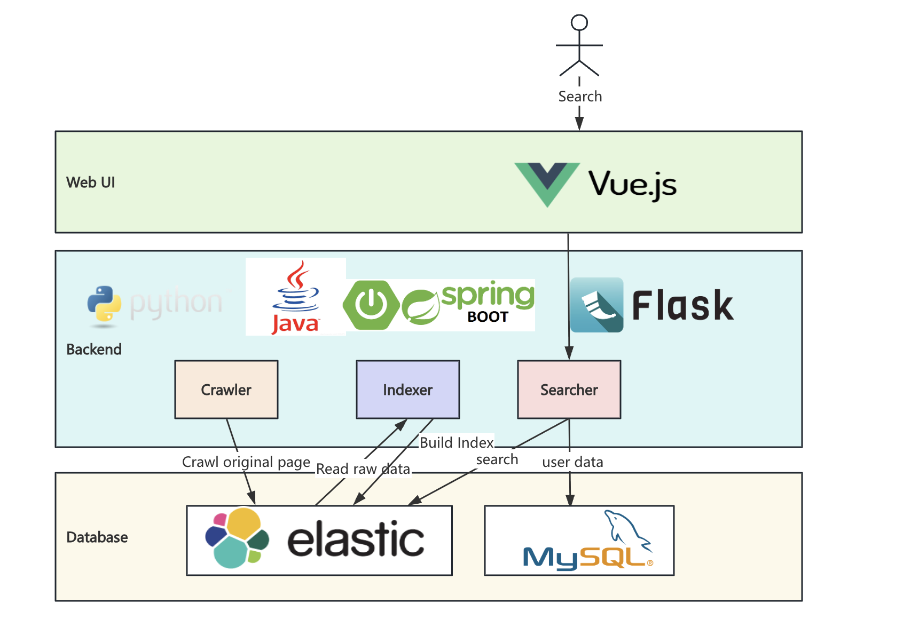

# Search Engine
## System Architecture

## Components
### Crawler
- Collect web pages starting from seed URL (https://www.cse.ust.hk/~kwtleung/COMP4321/testpage.htm) and parses text content
### Indexer
- Built with SpringBoot
- Build an inverted index with TF-IDF weighting and stores metadata for fast retrieval.
### Retrieval Function
- Built with Flask
- Based on the Vector Space Model (TF-IDF + Cosine Similarity).
- Supports:
  - Phrase search (e.g., "hong kong")
  - Keyword search
### Web Interface
- Built with Vue 3 + Element Plus.
- Main features:
  - Search box with autocomplete
  - Sidebar keyword filtering
  - Dual-mode sorting (by Relevance or Authority)
  - User login and search history tracking
  - Automatically detect and correct minor typos in search queries (e.g., "moive" -> "movie")

## Requirements

## Setup
### Crawler

### Indexer

### Backend 
- Start the Search API Server: ```python app.py```
### Frontend
- Start the Search Web UI: ```npm run serve```


